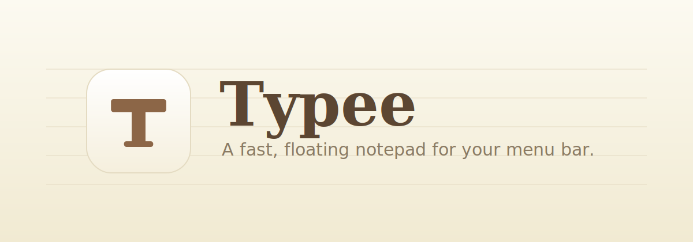
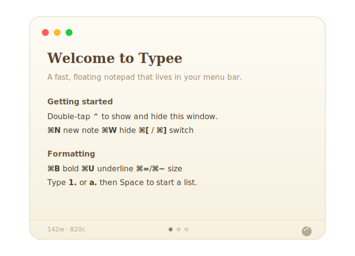

<p align="center">
  
</p>

<p align="center">
  <a href="https://github.com/ReyanshNangia/typee-app/releases/latest"></a>
  <a href="https://github.com/ReyanshNangia/typee-app/releases"></a>
  
  
  <a href="LICENSE"></a>
</p>

<p align="center">
  <b>Typee</b> is a fast, floating notepad that lives in your menu bar.<br>
  Double-tap a modifier key and it appears, anywhere — jot a thought, and double-tap to dismiss.
</p>

<p align="center">
  <a href="https://github.com/ReyanshNangia/typee-app/releases/latest"><b>⬇️ Download for macOS</b></a>
</p>

<p align="center">
  
</p>

---

## Features

- 🪶 **Floating & instant** — summon Typee from any app with a double-tap of **Control**, **Option**, or **Command**.
- 🗂 **Multi-note carousel** — swipe or use `⌘[` / `⌘]` to move between notes; drag the page dots to reorder.
- ✍️ **Rich text** — **bold** (`⌘B`), underline (`⌘U`), and per-selection font sizing with `⌘=` / `⌘−`.
- 🔢 **Smart lists** — type `1.`, `a.`, or `i.` then a space to start an auto-continuing numbered, lettered, or roman list.
- 🎨 **Color themes** — tint any note from a warm palette; even the scrollbar matches.
- 📊 **Live word & character count** in the corner.
- 🎚 **Appearance controls** — global font-size and window-opacity sliders.
- 💾 **Your notes, your folder** — keep them in iCloud, Dropbox, or anywhere you like.
- 🔁 **Reliable global hotkey** that survives sleep/wake, with persistent Accessibility permission.
- 🆕 **In-app update checks** — a menu-bar badge appears when a new version ships.

---

## Install

1. **[Download the latest `Typee-x.y.z.dmg`](https://github.com/ReyanshNangia/typee-app/releases/latest)**.
2. Open the DMG and **drag Typee onto the Applications folder**.
3. **First launch (one-time):** Typee is open-source and signed ad-hoc (not through a paid Apple Developer account), so macOS asks you to confirm the first time:
   - **Right-click** (or Control-click) **Typee** in Applications → **Open** → **Open**.
   - If macOS still blocks it, go to **System Settings → Privacy & Security**, scroll down to *“Typee was blocked”*, and click **Open Anyway**.
   - *Terminal alternative:* `xattr -dr com.apple.quarantine /Applications/Typee.app`
4. **Grant Accessibility:** the first time you use the hotkey, macOS opens **System Settings → Privacy & Security → Accessibility**. Toggle **Typee** on so the global double-tap can work.

> Look for the **T** in your menu bar. Double-tap **Control** (the default) to show or hide the window.

---

## Keyboard shortcuts

### Window
| Shortcut | Action |
|----------|--------|
| Double-tap `⌃` / `⌥` / `⌘` | Show / hide Typee (configurable) |
| `Esc` or `⌘W` | Hide |

### Notes
| Shortcut | Action |
|----------|--------|
| `⌘N` | New note |
| `⌘⇧N` | Delete current note |
| `⌘[` / `⌘]` | Previous / next note |
| Two-finger swipe | Move between notes |
| Overscroll past the last note | Spring-create a new note |

### Text
| Shortcut | Action |
|----------|--------|
| `⌘B` | Bold |
| `⌘U` | Underline |
| `⌘=` / `⌘−` | Grow / shrink selected text |
| `1.` `a.` `i.` + space | Start a numbered / lettered / roman list |
| `⌘A` `⌘Z` `⌘⇧Z` `⌘X` `⌘C` `⌘V` | Select all · undo · redo · cut · copy · paste |
| `⌘⇧V` | Paste as plain text |

Font size, opacity, the trigger key, and your notes folder all live in **Settings** (menu-bar icon → Settings).

---

## Updates

Typee checks for updates in the background and shows an **“Update Available”** badge in the menu bar when there’s a newer version. Click it (or **Settings → Check for Updates**) to open the download page.

> Because builds are signed ad-hoc, macOS treats each release as a new app, so you may need to re-grant Accessibility once after updating. That’s normal for notarization-free apps.

---

## Build from source

Requires the **Xcode Command Line Tools** (`xcode-select --install`). No full Xcode needed.

```bash
git clone https://github.com/ReyanshNangia/typee-app.git
cd typee-app
bash build-app.sh        # builds Typee.app for your Mac
open Typee.app
```

See **[BUILDING.md](BUILDING.md)** for details and the release workflow.

---

## FAQ

**“Typee is damaged and can’t be opened.”**
That’s Gatekeeper reacting to the quarantine flag on a downloaded, notarization-free app. Use the right-click → Open step above, or run `xattr -dr com.apple.quarantine /Applications/Typee.app`.

**The hotkey doesn’t do anything.**
Make sure **Typee** is enabled under **System Settings → Privacy & Security → Accessibility**. After an app update you may need to toggle it once more.

**Where are my notes stored?**
By default in `~/Library/Application Support/Typee/notes.json` — a plain JSON file you can back up. Change the location anytime in **Settings → Notes Storage**.

**Does it work on Intel Macs?**
Yes. The release is a universal binary (Apple Silicon + Intel).

---

## License

[MIT](LICENSE) © 2026 Reyansh Nangia. Made with ♥.
